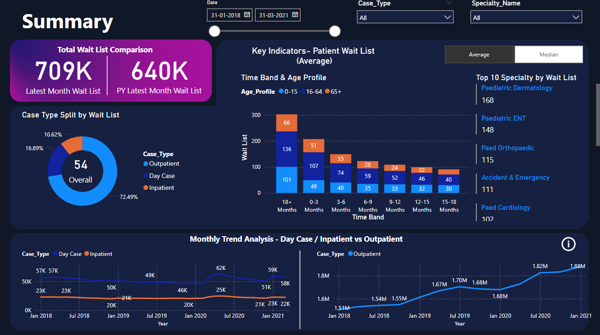
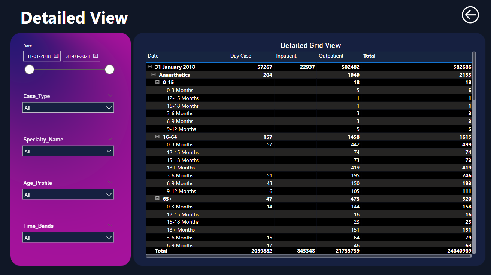

# 🏥 Hospital Patient Waiting List Analysis | Power BI

Hospitals worldwide face growing challenges with patient waitlists, impacting both operational efficiency and patient care. This project aims to analyze patient waitlist data to uncover patterns, optimize scheduling, and improve healthcare delivery.

---

## 📊 Project Overview

This interactive Power BI dashboard provides:

- ✅ **Tracking of patient waitlist trends** from Jan 2018 to Mar 2021
- ✅ **Separate analysis for Inpatients, Outpatients, and Day Cases**
- ✅ **Breakdowns by age group, time band, and specialty**
- ✅ **KPI cards and comparison with previous year waitlists**
- ✅ **Interactive slicers** for filtering by case type, specialty, date, etc.
- ✅ **Average vs. Median wait times** to address skewed data

---

## 📂 Dataset & Structure

**Source:** Healthcare Waitlist Data-Kaggle  
**Structure:**

- 4 CSV files for Inpatients (2018–2021)
- 4 CSV files for Outpatients (2018–2021)
- Time Range: **January 2018 – March 2021**

---

## 📌 Key Insights

1. **Growing Waitlists**: Total patients increased from **640K to 709K** in a year.
2. **Outpatients Dominate**: Account for **72%** of total waitlist.
3. **Trend Observations**:
   - Inpatients & Day Cases: Flat trend
   - Outpatients: Steady growth
4. **Peak Wait Periods**: 0–3 months and 18+ months dominate
5. **Top Specialties with Longest Median Waitlist**:
   - Accident & Emergency
   - Dermatology
   - Clinical Genetics
   - Cardiology
   - Pain Relief

---

## ✅ Recommendations

- 📈 Increase outpatient capacity
- 👵 Prioritize scheduling for elderly (65+)
- 👨‍⚕️ Hire more doctors in high-wait specialties
- ⏳ Optimize scheduling for critical wait periods (0–3 & 18+ months)

---

## 🖼️ Dashboard Screenshots

### Summary View

### Detailed View

---

## 🧠 Tools Used

- Microsoft Power BI
- Excel 
- DAX & Power Query

---

📌 Check out the project and feel free to contribute!

